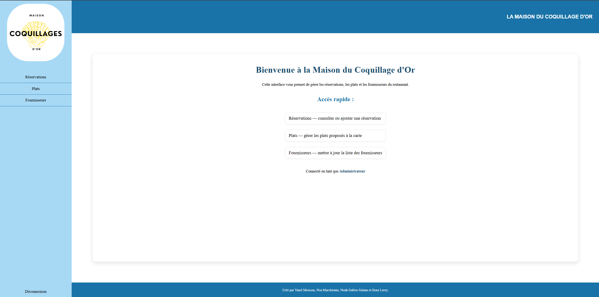
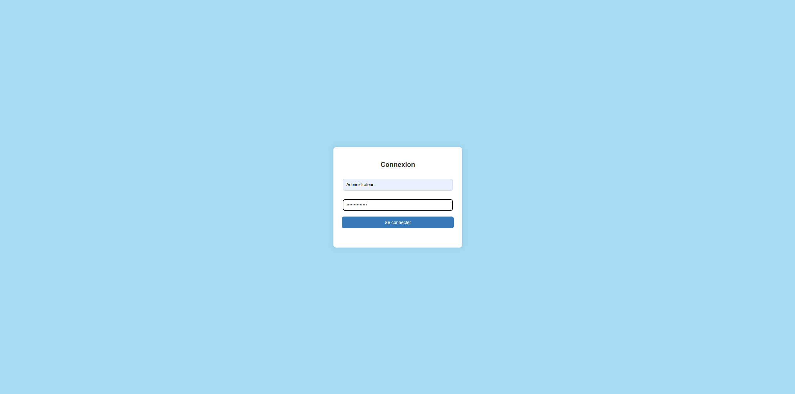

# restaurant-management-webapp

Academic team project: a PHP/MySQL web application to manage a restaurant activity (login, dashboard, and data management).

## Features
- User authentication (sessions)
- Dashboard
- CRUD (example: reservations / dishes / suppliers)

## Tech stack
- PHP
- MySQL
- HTML/CSS

## Setup (local)
1. Put the project in your web server (XAMPP / WAMP).
2. Create a MySQL database and import the provided SQL file (if available).
3. Update database credentials in the connection file.
4. Open `index.php` in your browser.
5. Login with the following credentials:

## Preview

## 🎥 Video Demo

## Demo Access
⚠️ These accounts are provided for demonstration purposes only.

**Admin account**
- Username: Administrateur
- Password: 83CCutv8@cf8ER

**User account**
- Username: Utilisateur
- Password: #bh73SLv7bteA

No real data is used in this project.
